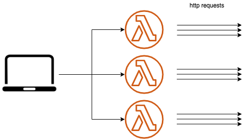

WIP....

<p align="center">
  
</p>
<p align="center">BigWave is simple, easy, load testing tool.</p>

## Architecture

Generate load script on your machine, then run worker nodes in AWS Lambda.

<p align="center">
  
</p>

## Install

```
$ npm install -g big-wave
```

## deploy

deploy worker nodes on aws lambda function.

```
$ bw deploy
```

## config

scenario.yml

```yml
phase:
  - concurrency: 10
    interval: 1000
    node: 10
  - concurrency: 20
    interval: 1000
    node: 20
scenarios:
  - url: 'https://test.k6.io/'
    method: 'get'
  - url: 'https://test.k6.io/contacts.php'
    method: 'get'
  - url: 'https://test.k6.io/news.php'
    method: 'get'
```

## run

```
$ bw run
```

## remove

remove worker nodes

```
$ bw remove
```
